# 🏗️ SGMP - Sistema de Gerenciamento de Manutenção Predial

### Descrição do Projeto

O SGMP (Sistema de Gerenciamento de Manutenção Predial) é uma aplicação desktop desenvolvida em Java (com interface Swing) e arquitetura MVC. O objetivo do sistema é facilitar a administração de ativos prediais, o gerenciamento de ordens de serviço, o controle de manutenções e a geração de relatórios estratégicos para tomada de decisão.

### Funcionalidades Implementadas

* [x] Autenticação: Sistema de login seguro com perfis de usuário (técnico).
* [x] Dashboard: Painel principal com indicadores visuais, como a contagem de ordens de serviço.
* [x] Gerenciamento de Ativos: Cadastro de equipamentos e instalações prediais.
* [x] Ordens de Serviço: Registro completo de manutenções preventivas e corretivas.
* [x] Relatórios: Exportação de dados em formatos PDF e CSV.
* [x] Auditoria: Tela de histórico ou logs de sistema, onde os registros são gerados por meio de triggers com base nas ações do usuário na interface.

### 💻 Tecnologias Utilizadas

- Linguagem: Java
- Interface Gráfica: Java Swing
- Arquitetura: MVC (Model-View-Controller)
- Banco de Dados: MySQL
- Versionamento: Git & GitHub
- Gestão Ágil: Trello (Kanban)

#

### ⌨️ Padrão de Commits

Este projeto segue o padrão de **commits semânticos**, inspirado nas convenções popularizadas por [@iuricode](https://github.com/iuricode/padroes-de-commits), para manter o histórico do versionamento limpo e compreensível.

#### Tipos de Commit:

| Tipo      | Descrição                                              |
|-----------|--------------------------------------------------------|
| `feat:`   | Implementação de nova funcionalidade                   |
| `fix:`    | Correções de bugs                                      |
| `docs:`   | Alterações na documentação (README, comentários, etc.) |
| `style:`  | Formatação do código (identação, espaços, etc.)        |
| `refactor:` | Refatoração de código sem alterar o comportamento    |
| `test:`   | Adição ou modificação de testes                        |
| `chore:`  | Tarefas de bastidores (builds, configs, etc.)          |

#### Exemplos de Commits Realizados:

```bash
Feat: Criando tela de login
Feat: Implementando exportação de relatórios
Fix: Corrigindo erro na tabela de ativos
Docs: Adicionando seção de banco de dados no README
Style: Ajustando espaçamento entre botões da interface
Chore: Configurando conexão com banco de dados
```
#

### 🗃️ Levantamento e Especificação de Requisitos

Realizamos todas as etapas do levantamento e especificação de requisitos, garantindo um entendimento completo das necessidades do sistema SGMP. Os documentos foram elaborados e estão hospedados no Google Docs para fácil acesso.

#### 📄 Questionário da Entrevista
Elaboração de perguntas utilizadas na entrevista com o cliente, focando em identificar o fluxo de trabalho, dificuldades e necessidades.
> [Link](https://docs.google.com/document/d/1ps0wNtz93WuUyDK8mljbKTysOqDLpctMojcDqPpnoTI/edit?usp=sharing) 📌

#### 📄 Requisitos de Domínio
Conceitos fundamentais do domínio do sistema definidos e organizados com base na análise do problema.
> [Link](https://docs.google.com/document/d/1oWmkHfssvZPxo5AAKzu7QTr0xqZELpZIPCCebPkwI0I/edit?usp=sharing) 📌

#### 📄 Especificação de Requisitos de Software (ERS)
Estrutura formal dos requisitos baseada em normas, incluindo descrições técnicas, casos de uso e validações.
>  [Link](https://docs.google.com/document/d/1Bg0-eWMiOYsKscdSR5RtrVGt5P-bJJvs/edit?usp=sharing&ouid=112196696086539442758&rtpof=true&sd=true) 📌
 
#

### 🖼️ Quadro de Tarefas (Trello)

O gerenciamento ágil do projeto foi feito com o uso da ferramenta Trello, por meio de um quadro no estilo Kanban, onde as tarefas foram organizadas em colunas como "A Fazer", "Em Andamento", "Em Revisão", "Concluído" e "Pendências". Essa abordagem garantiu a distribuição clara de responsabilidades e o acompanhamento do progresso da equipe.

Disponibilizamos o link da ferramenta abaixo:
> [Link](https://trello.com/b/0dYkWRqR/kanban-the-loggers) 📌

#

### 🧩 Protótipo do Sistema (Figma)

As telas abaixo foram desenvolvidas com base nos requisitos levantados, utilizando a ferramenta Figma. A seguir, estão as principais interfaces do sistema:

##### (Obs: As imagens são ilustrativas. O visual pode mudar no sistema, já que o Java Swing tem limitações de design.)

- Tela de Login
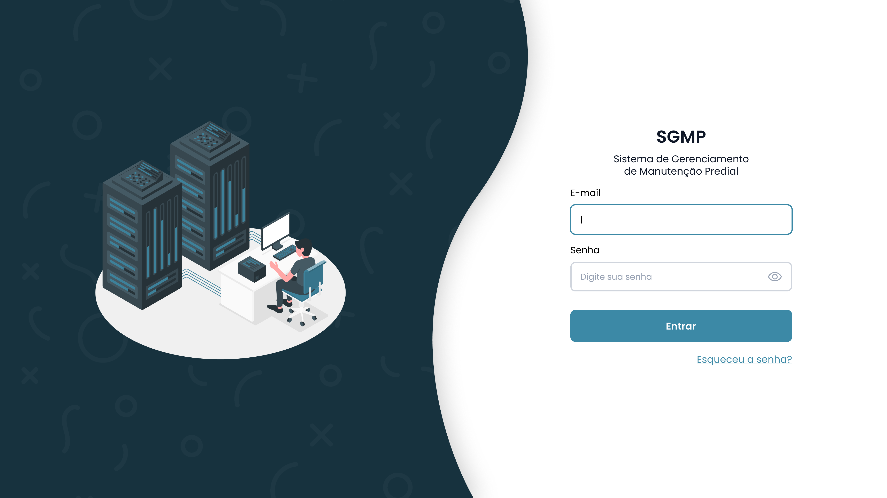

- Tela do Painel de Ordens de Serviços
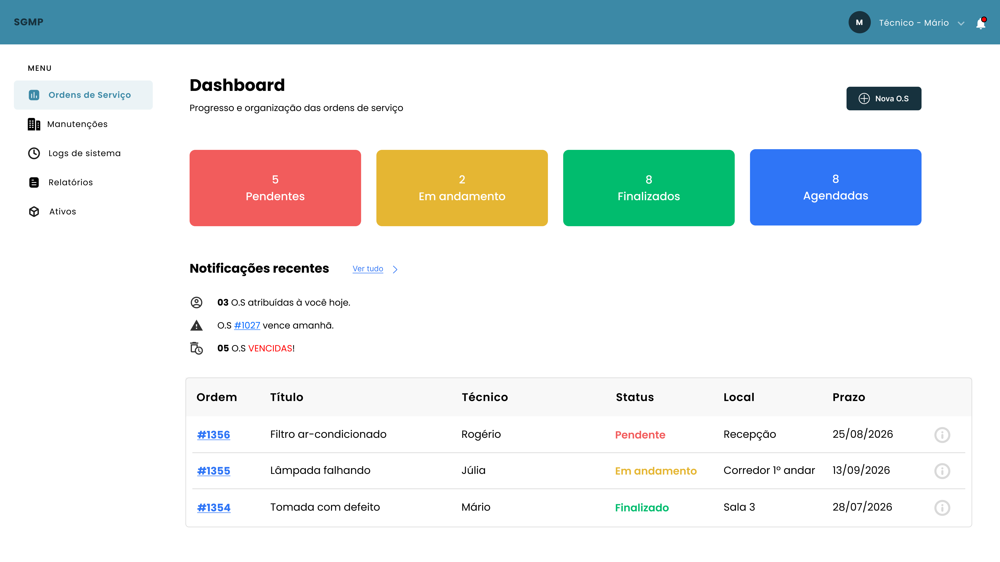

- Tela de Manutenção
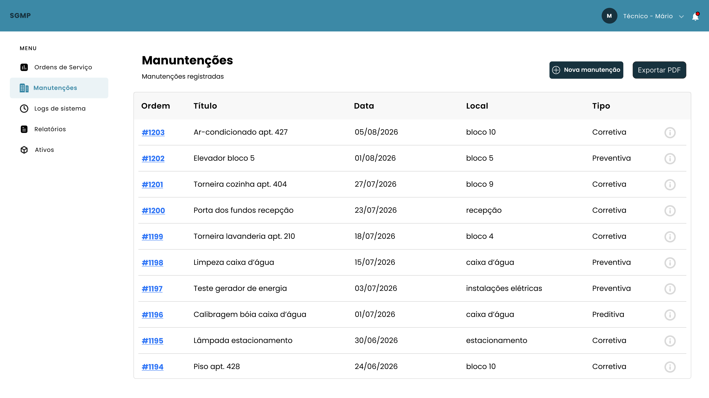

- Tela de Histórico ou Logs de sistema
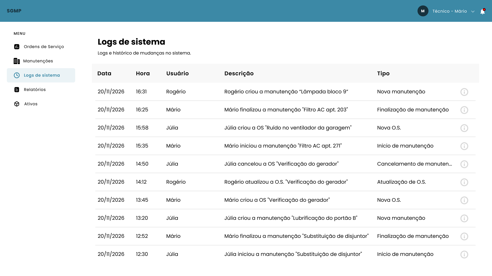

- Tela de Relatório
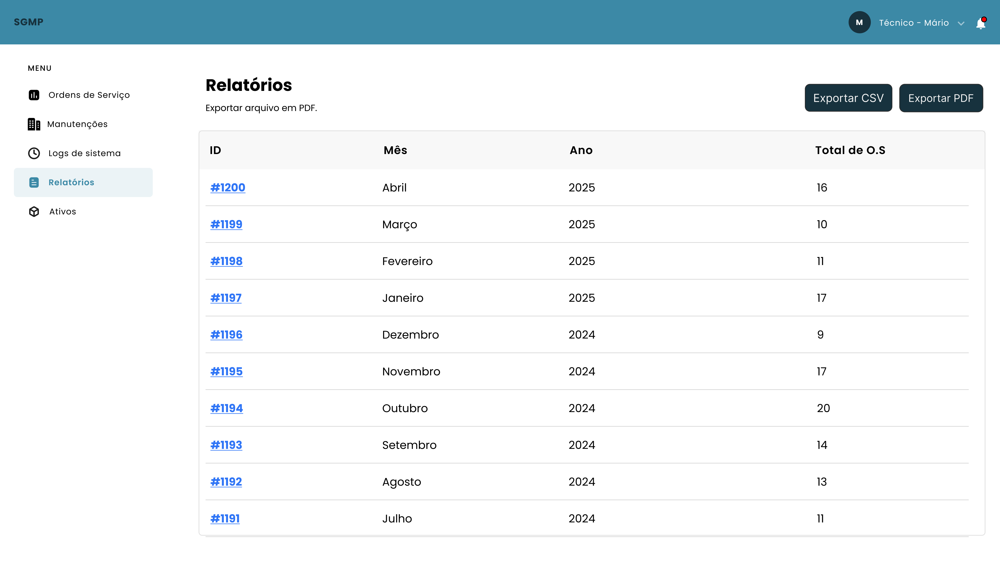

- Tela de Ativos
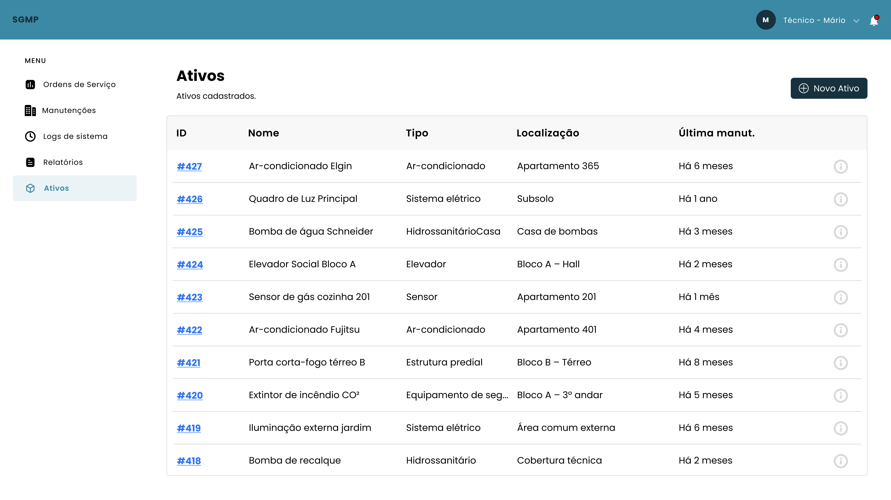

#

### 🏦 Banco de Dados

A modelagem geral do banco de dados foi feita utilizando o SGBD MySQL, atendendo aos principais requisitos definidos no escopo do projeto.

| Requisito              | ✔️ |
|------------------------|----|
| Modelagem Conceitual   | ✅ |
| Modelagem Lógica       | ✅ |
| Modelagem Física       | ✅ |
| Chave Primária (PK)    | ✅ |
| Chave Estrangeira (FK) | ✅ |
| Constraints            | ✅ |
| Consultas (SELECT)     | ✅ |

Onde está localizado as principais partes do Banco de Dados:

```txt
├── 📁 BancoDeDados/
│   ├── 📁 ModeloConceitual/
│   │   └── *ConceitualSGMP.png*
│   └── 📁 ModeloLogico/
│       └── *LogicoSGMP.png*
│
├── *ScriptSGMP.sql* ← Localizado na raiz do projeto (fora da pasta BancoDeDados)
```

#

### ⚙️ Manual de Usuário

### 1 Primeiro passo

Requisitos: Git instalado em sua máquina.

Clone o repositório via terminal em sua máquina utilizando o comando:

```bash
git clone https://github.com/realjcwkm/controle-manutencao-predial.git
```

### 2 Como configurar o banco de dados MySQL

Requisitos: MySQL e MySQL Workbench instalados na máquina com conexão configurada.

1 - Abra o MySQL Workbench

2 - Selecione a conexão onde deseja manipular o banco de dados
- 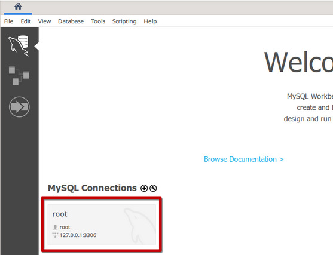

3 - Clique no ícone de abrir arquivo
- 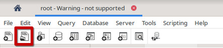

4 - Abra o arquivo ScriptSGMP.sql
- 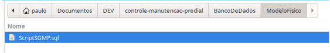

5 - Clique no ícone de executar script
- 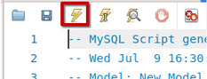

#

### 3 Como configurar e executar a aplicação no NetBeans

Requisitos: Ter o Java e todas as suas dependências devidamente instalados em sua máquina.

1 - Abra a IDE Apache NetBeans

2 - Clique em "Open Project…"
- 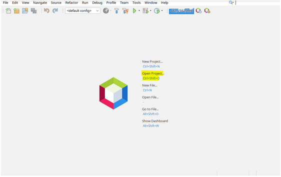

3 - Selecione a localização do projeto
- 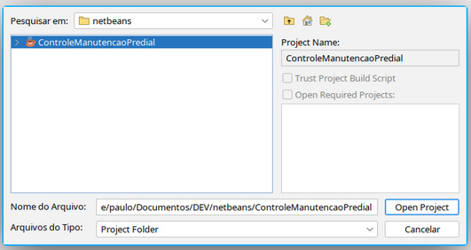

4 - No painel esquerdo, acesse br.com.loggers.model/Connect.java
- 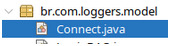

5 - Edite as linhas destacadas na imagem para refletir as configurações de usuário e senha do seu banco de dados MySQL
- 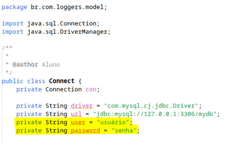

6 - No painel esquerdo, acesse br.com.loggers.view/View.java
- 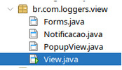

7 - Na barra superior, clique no ícone de execução
- 

#

### 👩🏻‍💻 Equipe - The Loggers

- João do Monte Andrade
- Luiz Guilherme Ribeiro Da Costa
- Matheus Henrique Sousa Lima
- Paulo Henrique Ximenes De Albuquerque
- Eduarda Vitória Leigue De Lima

#

### 🏁 Conclusão

Este projeto foi desenvolvido de forma colaborativa, com integração completa entre a interface gráfica (Swing) e o banco de dados relacional (SQL). A equipe aplicou os princípios do desenvolvimento orientado a boas práticas, como versionamento limpo, separação de responsabilidades (MVC) e commits padronizados, cumprindo todos os requisitos documentais, técnicos e práticos exigidos.
